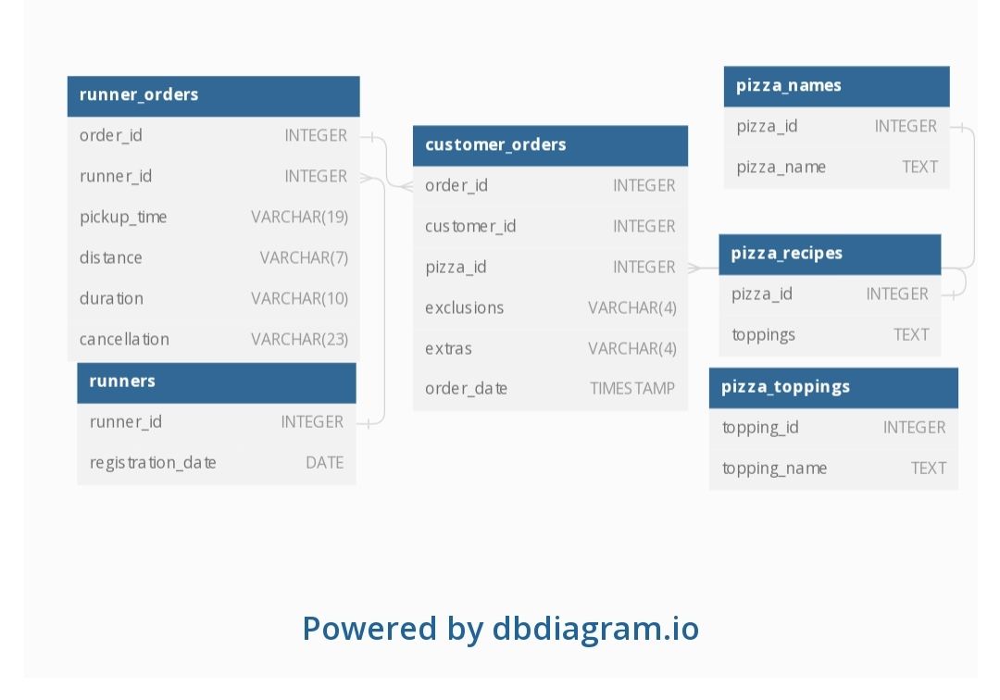

# Danny_ma-SQL-Challenge-week-2-soln

## Introduction
Did you know that over 115 million kilograms of pizza is consumed daily worldwide??? (Well according to Wikipedia anyway…)  

Danny was scrolling through his Instagram feed when something really caught his eye - “80s Retro Styling and Pizza Is The Future!”  

Danny was sold on the idea, but he knew that pizza alone was not going to help him get seed funding to expand his new Pizza Empire - so he had one more genius idea to combine with it - he was going to Uberize it - and so Pizza Runner was launched!  

Danny started by recruiting “runners” to deliver fresh pizza from Pizza Runner Headquarters (otherwise known as Danny’s house) and also maxed out his credit card to pay freelance developers to build a mobile app to accept orders from customers.  

## Available Data
Because Danny had a few years of experience as a data scientist - he was very aware that data collection was going to be critical for his business’ growth.  

He has prepared for us an entity relationship diagram of his database design but requires further assistance to clean his data and apply some basic calculations so he can better direct his runners and optimise Pizza Runner’s operations.  

All datasets exist within the pizza_runner database schema - be sure to include this reference within your SQL scripts as you start exploring the data and answering the case study questions.  

## Entity Relation Diagram 

   
## Case Study Questions
This case study has LOTS of questions - they are broken up by area of focus including:

### Pizza Metrics

**1. How many pizzas were ordered?** 

**2. How many unique customer orders were made?**

**3. How many successful orders were delivered by each runner?**

**4. How many of each type of pizza was delivered?**

**5. How many Vegetarian and Meatlovers were ordered by each customer?**

**6. What was the maximum number of pizzas delivered in a single order?**

**7. For each customer, how many delivered pizzas had at least 1 change and how many had no changes?**

**8. How many pizzas were delivered that had both exclusions and extras?**

**9. What was the total volume of pizzas ordered for each hour of the day?**

**10. What was the volume of orders for each day of the week?**
